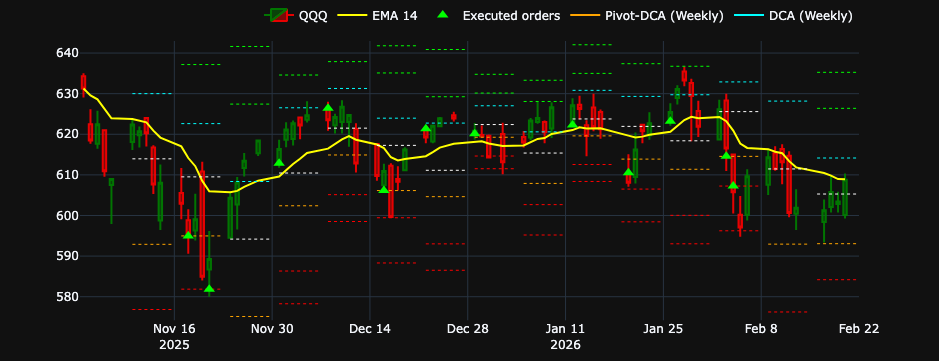
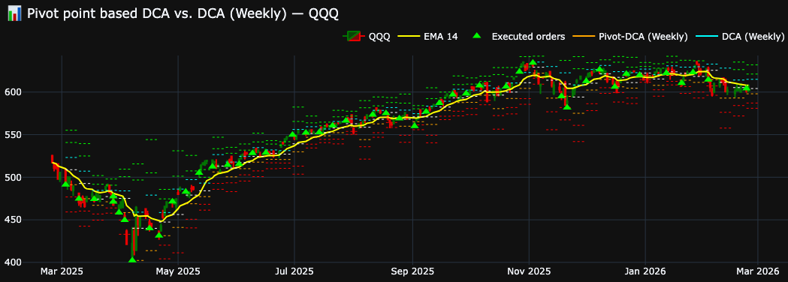
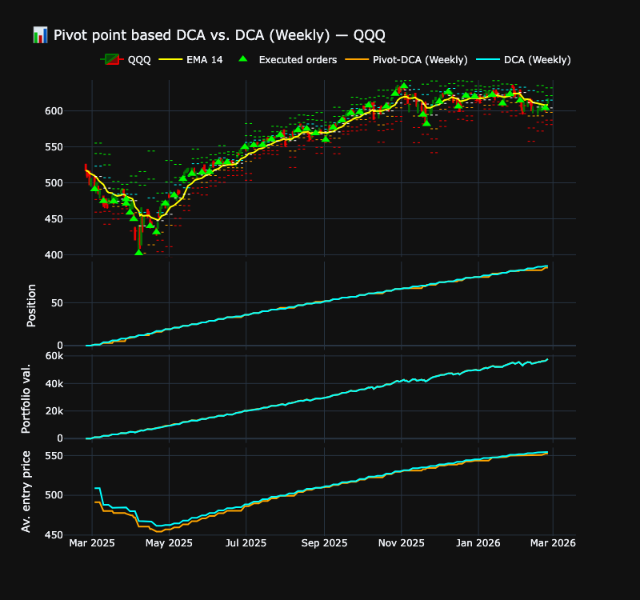
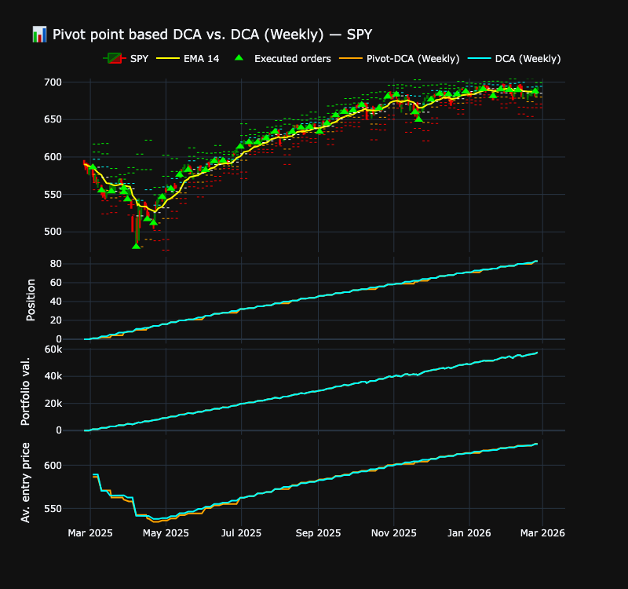

# 📊 Pivot Point–Based DCA Strategy vs. Regular DCA

## Overview

Background idea is that stocks are often attracted to pivot points. Assuming, the price could eventually go down to pivot levels, they could be more interesting entry points than just DCA periodic open prices.

Bellow chart shows an example where market price hits several times weekly pivot levels.



This project implements and compares two systematic investment strategies:

1. **Regular Weekly DCA (Dollar-Cost Averaging)**
2. **Pivot Point–Based Weekly DCA**

The objective is to evaluate whether allocating weekly capital using technical pivot levels can improve capital efficiency compared to a standard weekly DCA approach.

The backtest includes:

- Full trade simulation  
- Cash tracking  
- Position sizing  
- Portfolio valuation  
- IRR computation (annualized)  
- Interactive visualization with Plotly  

## Strategy Description

### 1️⃣ Regular Weekly DCA

- Invests a fixed amount every week.
- Buys at the **open price of the first trading day of each new week**.
- Option to allow or disallow fractional shares.
- Uninvested cash is carried forward.

This strategy serves as the benchmark.

### 2️⃣ Pivot-Based Weekly DCA

Each week:

1. Weekly pivot levels are computed from the previous week's OHLC data:
   - P (Pivot)
   - R1, R2, R3 (Resistance levels)
   - S1, S2, S3 (Support levels)

2. Strategy logic:
   - If previous close is above EMA → buy at weekly open (behaves like regular DCA).
   - Otherwise:
     - Place limit orders at pivot levels below previous close.
     - Use up to `max_pivots` closest eligible levels.
     - Execute orders if price trades through pivot during the week.

3. Cash not deployed remains available for future weeks.

In following chart, we can see entry point on NASDAQ where orders are :
- executed at pivot points while market is bearish
- executed at open price while market is bullish



## Parameters

Available backtest parameters:

```python
ticker = "QQQ" # Ticker name
start_date = "2025-11-04" # Backtest start date
weekly_budget = 1000  # weekly budget to be invested
allow_fractional_shares = False # buy fractional shares of the asset
```

Pivot-point based DCA parameters:

```python
pivot_DCA_param = {
    "max_pivots": 2, # Depth of pivot levels to use
    "ema_filter": True, # Use price to EMA relative position to arbitrate whether to use pivot levels or buy at next week open price
    "ema_period": 14, # EMA period
    "pivot_colors": { # for display
        "S3": "red",
        "S2": "red",
        "S1": "orange",
        "P": "white",
        "R1": "cyan",
        "R2": "lime",
        "R3": "lime",
        }
}
```

## Limitations

- No transaction costs
- No slippage modeling
- No tax considerations
- No liquidity constraints
- Assumes perfect order execution at pivot levels

## Disclaimer

This code is provided for educational and informational purposes only.
It does not constitute investment advice.
The author assumes no responsibility for financial decisions made based on this project.

## NASDAQ backtest

Using following parameters:

```python
ticker = "QQQ" # NASDAQ-100
start_date = "2025-02-24" #"2025-10-26"
weekly_budget = 1000  # weekly budget to be invested
allow_fractional_shares = False #pivot_levelsbuy fractional shares of the asset

pivot_DCA_param = {
    "max_pivots": 2, # Depth of pivot levels to use
    "ema_filter": True, # Use EMA position to arbitrate the strategy
    "ema_period": 14, # EMA period
}
```

We get following results:

```
--- Pivot-based DCA ---
Total cash invested: 52,000
Final portfolio value: 56,992
Total return: 9.60%
Annualized IRR: 19.40%
QQQ final position: 91.0000
Remaining cash : 1740.30

--- DCA ---
Total cash invested: 52,000
Final portfolio value: 56,900
Total return: 9.42%
Annualized IRR: 19.03%
QQQ final position: 93.0000
Remaining cash : 434.02
```


## S&P 500 backtest

Using following parameters:

```python
ticker = "SPY" # S&P500
start_date = "2025-02-24" #"2025-10-26"
weekly_budget = 1000  # weekly budget to be invested
allow_fractional_shares = False #pivot_levelsbuy fractional shares of the asset

pivot_DCA_param = {
    "max_pivots": 2, # Depth of pivot levels to use
    "ema_filter": True, # Use EMA position to arbitrate the strategy
    "ema_period": 14, # EMA period
}
```

We get following results:

```
--- Pivot-based DCA ---
Total cash invested: 52,000
Final portfolio value: 57,197
Total return: 9.99%
Annualized IRR: 20.22%
SPY final position: 83.0000
Remaining cash : 135.67

--- DCA ---
Total cash invested: 52,000
Final portfolio value: 57,235
Total return: 10.07%
Annualized IRR: 20.37%
SPY final position: 83.0000
Remaining cash : 173.66
```

